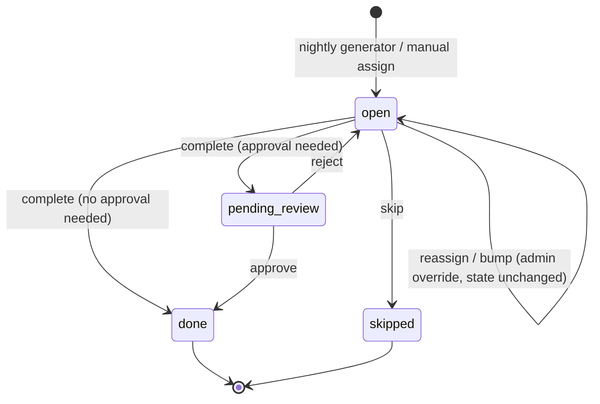

# Family Chore Tracker — App Spec (v2)

**Changelog from v1:** adds assignment lifecycle management (admin bump /
reassign), explicit handling for monthly/interval chores, an
inspection/approval workflow for kid-marked completions, and a process for
maintaining the chore list directly in the Google Sheet.

## 1. Overview

A lightweight, installable web app (PWA) for tracking household chores across
5–8 family members. Backend is a single Google Sheet, managed through a
Google Apps Script Web App acting as a minimal REST API. Push reminders are
sent via Firebase Cloud Messaging (FCM).

**Design priorities:** easy to build, free to run, installable on iPhone and
Android without app store distribution, low maintenance.

---

## 2. Data Model (Google Sheet)

One spreadsheet, three tabs.

### `People`
| Column | Type | Notes |
|---|---|---|
| person_id | string | short unique id (e.g. `p_jess`) |
| name | string | display name |
| color | string | hex color for UI avatar/badges |
| fcm_token | string | set on first push-permission grant; may be blank |
| points_total | number | running total, updated on completion |
| streak_current | number | consecutive days with all assigned chores **accepted** |
| streak_best | number | best streak ever, for bragging rights |
| **is_admin** | boolean | parent/admin flag. Gates admin-only actions (reassign, bump, approve, reject) and the "needs review" view. Enforced client-side only — see §6 known limitations. |

### `Chores`
| Column | Type | Notes |
|---|---|---|
| chore_id | string | short unique id |
| name | string | e.g. "Take out trash" |
| points | number | awarded on **acceptance**, not on marking complete |
| frequency | enum | `daily`, `weekly`, `custom`, `monthly`, `interval` |
| custom_days | string | comma list of weekdays, only used if `custom` |
| **monthly_day** | number (nullable) | day-of-month (1–31), only used if `monthly`. If the month is shorter (e.g. 30 set, but month has 28 days), clamp to the last day of the month. |
| **interval_days** | number (nullable) | only used if `interval`, e.g. `90` for "change air filters every 90 days" |
| **last_generated_date** | date | written by the nightly generator; the anchor point for computing the next due date of `monthly`/`interval` chores. Not meant to be hand-edited (see §9). |
| default_assignee | string (nullable) | person_id, or blank = unassigned/claimable |
| **requires_approval** | boolean | if true, completions by non-admins go to `pending_review` instead of `done` until a parent approves. Default `false` for low-stakes chores; flip on for ones worth checking (e.g. "clean room" vs. "make your bed"). |
| active | boolean | soft-disable instead of deleting |

### `Assignments`
Append-only log — avoids concurrent-write conflicts. Past rows are never
edited except for the two sanctioned exceptions below: routine status
updates on today's open rows, and deliberate admin overrides (reassign/bump),
which are logged via the audit columns.

| Column | Type | Notes |
|---|---|---|
| assignment_id | string | unique id, e.g. `chore_id` + date |
| chore_id | string | FK to Chores |
| person_id | string (nullable) | null = unassigned, claimable by anyone |
| due_date | date | |
| status | enum | `open`, **`pending_review`**, `done`, `skipped`, **`rejected`** |
| completed_at | datetime | set when a person marks the chore done (kid or admin) — blank until then. For rejected-then-redone chores, this is cleared again on reject. |
| assigned_by | enum | `auto` (nightly generator) or `manual` (a parent) |
| points_awarded | number | snapshot of points at **acceptance** (in case chore points change later). Blank while `pending_review`. |
| **reviewed_by** | string (nullable) | person_id of the admin who approved/rejected. Blank if the chore didn't need review. |
| **reviewed_at** | datetime (nullable) | when approve/reject happened |
| **review_note** | string (nullable) | optional short feedback from admin on reject, e.g. "redo — missed under the bed" |
| **last_modified_by / last_modified_at** | string / datetime (nullable) | set whenever an admin uses `reassign` or `bump` on this row; audit trail for the one case where an existing row's core fields (`person_id`, `due_date`) change after creation |

---

## 3. Backend: Google Apps Script Web App

Deployed as a Web App bound to the Sheet (`doGet`/`doPost`), access set to
"anyone with the link." The link itself is the only access control — fine
for a family-only tool, not meant for sensitive data. Admin-only endpoints
below are gated by the client checking `is_admin` before showing the control
and sending the request — there is no server-side identity check, consistent
with the no-auth model in §6.

### Endpoints

**`GET ?action=today`**
Returns: all open/pending_review/done assignments for today + this week,
joined with chore name/points/requires_approval and person name/color.
This is the main data the app polls on load and on pull-to-refresh.

**`GET ?action=people`**
Returns: People tab (for picker on first launch, leaderboard view).

**`GET ?action=chores`**
Returns: full Chores list (for the admin/edit screen).

**`POST ?action=complete`**
Body: `{ assignment_id, person_id }`
- Looks up the chore's `requires_approval` flag and whether `person_id` is an
  admin.
- If `requires_approval` is false, **or** the person completing it is an
  admin → sets status `done` immediately, `completed_at` = now,
  `points_awarded` = chore's current points, updates that person's
  `points_total` and recalculates `streak_current` (same as v1 behavior).
- If `requires_approval` is true and the person is not an admin → sets
  status `pending_review`, `completed_at` = now, `points_awarded` left
  blank. No points or streak credit yet.

**`POST ?action=approve`** *(admin only)*
Body: `{ assignment_id }`
- Requires current status `pending_review`.
- Sets status `done`, `points_awarded` = chore's current points,
  `reviewed_by`/`reviewed_at` = approving admin/now.
- Updates the assignee's `points_total` and `streak_current` — this is the
  only point at which a reviewed chore contributes to points/streaks.

**`POST ?action=reject`** *(admin only)*
Body: `{ assignment_id, review_note? }`
- Requires current status `pending_review`.
- Sets status back to `open`, clears `completed_at`, stores
  `reviewed_by`/`reviewed_at`/`review_note`. The kid sees it reappear in
  their Today list (optionally flagged "sent back") and can redo it.
- No points awarded.

**`POST ?action=skip`**
Body: `{ assignment_id }` — marks `skipped`, no points.

**`POST ?action=claim`**
Body: `{ assignment_id, person_id }` — for unassigned chores; sets
`person_id` and `assigned_by = manual`.

**`POST ?action=assign`**
Body: `{ chore_id, person_id, due_date }` — parent manually creates/reassigns
an assignment.

**`POST ?action=reassign`** *(admin only)*
Body: `{ assignment_id, person_id }`
- Changes the assignee on an existing `open` or `pending_review` assignment
  (e.g. "Sam's busy, give it to Jess instead").
- Sets `last_modified_by`/`last_modified_at`. Does not touch `due_date` or
  `status`.

**`POST ?action=bump`** *(admin only)*
Body: `{ assignment_id, due_date }`
- Moves an assignment's due date, typically forward (e.g. "lawn's too wet
  today, push to Saturday"), but backward is allowed too for fixing mistakes.
- Sets `last_modified_by`/`last_modified_at`. Does not touch `person_id`.
- Bumping a chore does not change `last_generated_date` on the Chores tab —
  that's only ever updated by the nightly generator — so a bumped chore
  won't suppress its next normal occurrence.

**`POST ?action=add_chore`** / **`update_chore`**
Body: chore fields — admin screen writes.

**`POST ?action=register_token`**
Body: `{ person_id, fcm_token }` — called once the device grants
notification permission.

### Scheduled jobs (Apps Script time-based triggers)

**Nightly generator (runs ~12:01am)**
For every active chore, determine whether it's due today:
- `daily` / `weekly` / `custom` — derived purely from today's date/weekday,
  same as v1, recomputed fresh each run.
- `monthly` — due if today's day-of-month matches `monthly_day` (clamped to
  month length).
- `interval` — due if `today - last_generated_date >= interval_days`.
- **Catch-up rule:** for `monthly`/`interval` chores, "due" actually means
  *due or overdue* — if a trigger run was missed (script disabled, quota
  issue, etc.) and a monthly chore's date silently passed, the next run that
  notices it's overdue generates it immediately rather than waiting for the
  next natural occurrence. This avoids silently dropping a whole month's
  occurrence of something like "change air filters."
- On generating an assignment for a `monthly`/`interval` chore, set
  `last_generated_date` = today on the Chores tab.
- If `default_assignee` is set → create an `Assignments` row, `assigned_by = auto`.
- If not → create a row with `person_id` blank, status `open`, available to
  claim by anyone.

**Streak maintenance (runs ~11:55pm)**
For each person: if all of today's assigned chores have status `done`
(i.e. completed **and accepted** — `pending_review` does not count),
increment `streak_current`; otherwise reset to 0. Update `streak_best` if
exceeded. This is the reason approval matters for streaks: a kid marking
something complete that never gets reviewed shouldn't be able to bank a
streak off an unreviewed claim.

**Reminder push (runs every ~30 min, or on assignment creation)**
For assignments still `open` past a configurable reminder time (e.g. 6pm),
call FCM HTTP v1 API with that person's `fcm_token` to send a reminder.
Also fires immediately when a chore is newly assigned to someone (including
via `reassign`) or bumped to a new date via `bump`.
Separately, consider a daily admin-facing digest ("3 chores pending review")
rather than per-item pushes for review reminders, since approval is
lower-urgency than the kid's own reminder.

> **Note on push implementation:** raw Web Push (VAPID-signed) is avoided —
> Apps Script doesn't have solid support for the ECDSA signing and payload
> encryption it requires. FCM sidesteps this: Apps Script just does an
> authenticated `UrlFetchApp` POST to FCM's HTTP v1 endpoint, which is simple
> and well-documented.

---

## 4. Frontend: PWA

**Stack:** lightweight framework (Svelte recommended for small PWA bundle
size) + a service worker for installability and the FCM web SDK for
receiving pushes.

### Required first-run flow
1. "Who are you?" — pick your name from the `People` list (stored locally,
   no real login).
2. **Add to Home Screen prompt** — shown as a required step, not skippable
   without an explicit "I'll do this later" tap. iPhone users get explicit
   copy: *"On iPhone, reminders only work once this app is added to your
   Home Screen — tap Share → Add to Home Screen."* This is the one fragile
   point in the whole stack and the UI should not let people miss it.
3. Notification permission prompt → on grant, register FCM token via
   `register_token`.

### Core screens

**Today** (home screen)
- My chores for today, tap to mark done (big touch target, satisfying
  check animation — small delight goes a long way for a chore app). If the
  chore `requires_approval`, the check animation lands on a distinct
  "waiting for review" state rather than the normal "done" state, so kids
  aren't confused about why points haven't shown up yet.
- Family's chores today, read-only view of others' status, including a
  small "waiting for review" badge on pending items.
- Unassigned chores, with a "claim" button.
- **Admin controls** (visible only if `is_admin`): on any assignment, an
  overflow menu with **Reassign** (person picker) and **Bump** (date
  picker). On `pending_review` items specifically, **Approve** / **Reject**
  buttons appear inline rather than in the overflow menu, since review is
  the primary admin action and shouldn't require extra taps. Reject opens a
  one-line optional note field.
- Admins additionally see a **"Needs review" filter/section** at the top of
  the Today view when there's anything pending, so review doesn't get lost
  among everyone else's chores.

**Leaderboard / Streaks**
- Points total per person, this week and all-time
- Current streak + best streak, small badge/flame icon styling
- Purely motivational — no punitive framing, no negative numbers

**Chores (admin)**
- Add/edit chore: name, points, frequency (including `monthly` day-picker
  and `interval` day-count field when those frequencies are selected),
  default assignee, **requires approval toggle**.
- Toggle active/inactive instead of delete, to preserve history.

**History** (optional, nice-to-have)
- Simple log of completed/skipped/rejected chores by date, mostly for
  parents to glance at fairness over time. Rejected entries showing the
  `review_note` are useful here too — a quick record of "what keeps getting
  sent back."

---

## 5. Assignment lifecycle & management

Every assignment moves through a small state machine. Most chores only ever
touch the left-hand path; the review states only apply when
`requires_approval` is true and the completer isn't an admin.

**Who can do what:**
- Anyone (kid or admin): `complete` (on their own assignment), `skip`,
  `claim` (on unassigned chores).
- Admins only: `approve`, `reject`, `reassign`, `bump`, `assign`,
  `add_chore`/`update_chore`.

**Reassign vs. bump, in plain terms:**
- *Reassign* = "this is still due today, just give it to someone else."
- *Bump* = "the right person has it, just not today — move the date."
- Both are logged via `last_modified_by`/`last_modified_at` so there's a
  record of admin overrides distinct from the normal auto/manual assignment
  trail, but neither creates a new row — they mutate the existing open
  assignment in place, which is the one deliberate exception to the
  append-only rule for `Assignments`.

**Why `pending_review` matters for fairness:** without it, a kid could tap
"done" on an unfinished chore and immediately bank points and streak credit.
With it, the chore visibly sits in a "waiting for review" state — neither
counted as done nor silently lost — until a parent looks at it. Chores
where this kind of check doesn't matter (e.g. "make your bed") can simply
leave `requires_approval` off and behave exactly as in v1.

---

## 6. Known limitations (accepted for this lightweight build)

- **No real auth** — anyone with the app link can act as any family member,
  including ticking the `is_admin` flag's effects: the admin-only endpoints
  (`approve`, `reject`, `reassign`, `bump`, etc.) are only gated by the
  client UI checking who's "logged in" locally, not by the server. A
  technically savvy kid could call the API directly and approve their own
  chores. Acceptable for in-home use; not suitable if the link could leak
  publicly or if you need this to be tamper-proof.
- **iOS push depends on home-screen install** — flagged in onboarding, but
  if a family member skips it or is on an old iOS version, they simply
  won't get reminders (app still works, just silently without alerts).
- **Apps Script cold starts** — occasional 1–2s lag on first request after
  idle; not a problem for a casual chore app.
- **Sheet as DB** — fine at this scale (5–8 people, growing chore list);
  would need to migrate to a real DB only if usage grew far beyond a
  single household. See §9 for how to keep the sheet itself manageable as
  it grows.

---

## 7. Suggested build order

1. Sheet + Apps Script API (`today`, `complete`, `skip` endpoints first)
2. Bare-bones PWA: Today screen, mark-done, polling for refresh
3. Add to Home Screen onboarding flow + FCM token registration
4. Nightly generator (daily/weekly/custom first) + reminder push trigger
5. Points/streaks logic + Leaderboard screen
6. Admin screen for chores, including `monthly`/`interval` frequency fields
7. Approval workflow: `requires_approval`, `pending_review` status,
   `approve`/`reject` endpoints, "needs review" admin view
8. Admin overrides: `reassign`/`bump` endpoints + overflow menu UI
9. History screen (optional polish)

---

## 8. Assignment model: mixed manual + auto

- Chores with a `default_assignee` auto-generate daily/weekly/monthly/
  interval via the nightly job — good for fixed responsibilities (e.g.
  "Sam always does the dishes", "change the air filter every 90 days").
- Chores without one appear as **unassigned/claimable** — good for
  rotating or flexible tasks. A parent can also manually assign these
  via the admin screen at any time, overriding the claimable state, and
  can `reassign`/`bump` any assignment afterward if plans change.
- This gives flexibility without needing a rotation algorithm — rotation
  can be added later by having the nightly job cycle `default_assignee`
  through a list, if it turns out to be wanted.

---

## 9. Managing the chore list in Google Sheets

The `Chores` tab is meant to be edited two ways — through the admin screen
(preferred for day-to-day changes) and directly in the sheet (fine for bulk
edits or anything the admin UI doesn't expose yet) — but a few fields need
care either way.

**Safe to hand-edit directly in the sheet at any time:**
`name`, `points`, `frequency`-related fields (`custom_days`, `monthly_day`,
`interval_days`), `default_assignee`, `active`, `requires_approval`. Editing
`points` only affects *future* completions — past `Assignments` rows keep
their `points_awarded` snapshot, so a point-value rebalance across the whole
chore list is safe to do in bulk directly in the sheet.

**Don't hand-edit:**
- `chore_id` — it's the foreign key every `Assignments` row references; an
  unsynced change orphans the chore's entire history.
- `last_generated_date` — owned by the nightly generator. Manually changing
  it can cause a `monthly`/`interval` chore to double-generate (set too far
  in the past) or silently skip an occurrence (set to today when it
  shouldn't be).

**Adding a chore:** prefer the admin screen so `chore_id` generation stays
consistent (slug of the name + a disambiguating suffix if needed). If adding
a row directly in the sheet, follow the same `chore_id` convention used by
existing rows.

**Removing a chore:** never delete the row. Set `active = false`. This keeps
the foreign-key relationship intact for every historical `Assignments` row
that referenced it, and lets it be reactivated later without losing history.

**Sheet protection:** since the only sanctioned writers of `Assignments` are
the Apps Script API and the nightly/streak/reminder triggers, it's worth
using Google Sheets' Data → Protected sheets and ranges to lock the header
row and the `chore_id`/`person_id` columns of `Assignments` against
accidental manual edits, leaving the rest editable for a parent doing a
quick manual correction if something goes wrong.

**Archiving:** `Assignments` is append-only and grows by roughly one row per
active chore per occurrence — at 10–15 chores across daily/weekly/monthly
frequencies for 6 people, that's a few thousand rows a year, which Apps
Script can still read comfortably but won't stay comfortable forever. As a
once-a-year housekeeping task, move rows older than ~6–12 months to a
separate `Assignments_Archive` tab (same schema, just not read by the live
API), keeping the live tab fast for the `today` endpoint and the streak job.